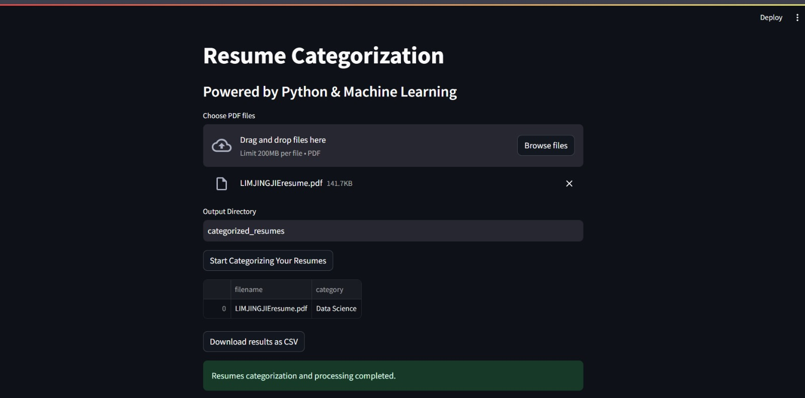

# Resume Categorization powered by Streamlit and Machine Learning

This project leverages machine learning to categorize resumes efficiently. Using Streamlit for an interactive web application and a Kaggle dataset for training, the goal is to automatically classify resumes into predefined categories. The project showcases the use of natural language processing (NLP) and classification algorithms to streamline the resume screening process.

## Dataset
The dataset used for this project is sourced from Kaggle: [Updated Resume Dataset](https://www.kaggle.com/datasets/jillanisofttech/updated-resume-dataset). This dataset contains a diverse set of resumes and is used to train and evaluate the model’s performance.

## Technologies
- **Streamlit:** For building the interactive web interface.
- **Python:** For implementing machine learning models.
- **Scikit-learn:** For model building and evaluation.
- **Pandas:** For data manipulation and analysis.
- **NLTK:** For natural language processing tasks.

## Usage
1. Clone the repository.
`git clone https://github.com/bron322/ResumeCategorization`
2. `python -m venv venv`
3. `.\venv\Scripts\activate`
4. `pip install -r requirements.txt`
5. `streamlit run app.py`
